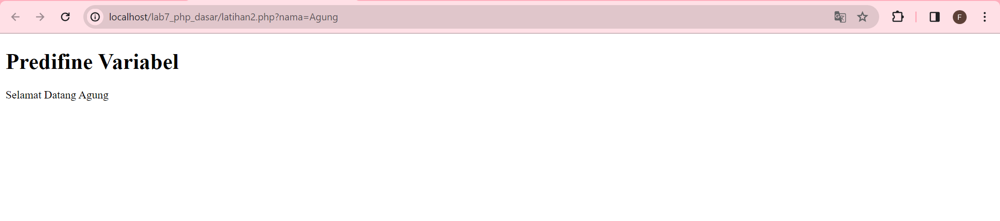
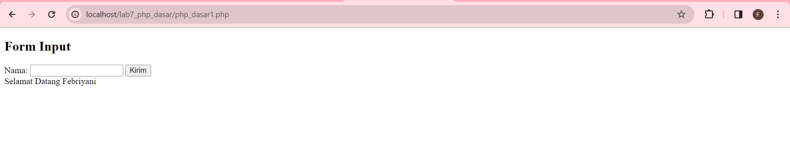
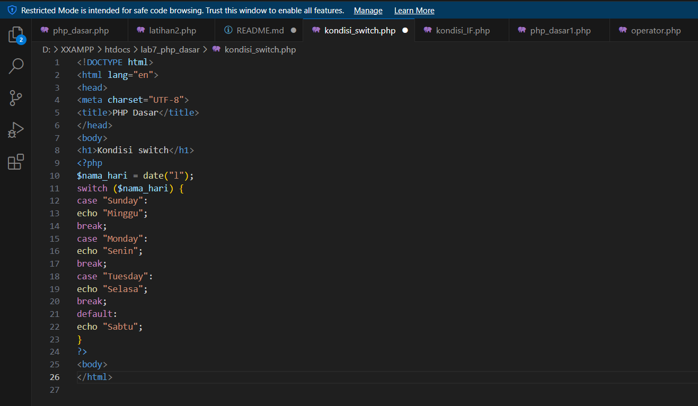

# Praktikum 7: PHP Dasar

## Instruksi Praktikum
1. Persiapkan text editor misalnya VSCode.
2. Buat folder baru dengan nama lab7_php_dasar pada docroot webserver (htdocs)
3. Ikuti langkah-langkah praktikum yang akan dijelaskan berikutnya.

## Langkah-langkah Praktikum
### Persiapan
Untuk memulai membuat kode php, perlu disiapkan web server dan interpreter PHP
terlebih dahulu. Web servar yang kita gunakan adalah Apache 2 dan interpreter PHP 7.
Untuk memudahkan proses praktikum, kita gunakan aplikasi bundle web server yaitu
XAMPP.

### Install XAMPP
Unduh XAMPP dari https://www.apachefriends.org/download.html dan pilih versi
portable untuk memudahkan proses installasi. Kemudian extract file tersebut, seusikan
direktorinya (misal: d:\xampp).


### Konfigurasi Web Server
• Konfigurasi Apache
Untuk konfigurasi HTTP server, seperti port yang digunakan akses HTTP, modul
yang diaktifkan, lokasi document root, dll.
Lokasi file: \xampp\apache\conf\httpd.conf

• Konfigrasi PHP
Untuk konfigurasi perilaku engine PHP yang berefek pada keamanan dan performa.
Seperti batas maksimal waktu eksekusi script, batas file yang dapat diupload, error
reporting, dll.
Lokasi file: \xampp\php\php.ini

• Konfigrasi MySql
Konfigurasi server MySQL, seperti administrator user, port, timezone, dll.
Lokasi file: \xampp\mysql\bin\my.ini
Menjalankan Web Server
Untuk menjalankan web server dari menu XAMPP Control.


• Uji coba apakah server sudah berkerja dengan baik
http://127.0.0.1 atau http://localhost
Tampil halaman utama XAMPP jika server sudah berkerja dengan baik.

• Dokumen Website
Semua file website tempatkan di direktori: \xampp\htdocs\

• Database MySQL
Direktori: \xampp\mysql\
Manajemen database: http://localhost/phpmyadmin

### Memulai PHP
Buat folder lab7_php_dasar pada root directory web server (d:\xampp\htdocs)


Kemudian untuk mengakses direktory tersebut pada web server dengan mengakses URL:
http://localhost/lab7_php_dasar/


### PHP Dasar
Buat file baru dengan nama php_dasar.php pada directory tersebut. Kemudian buat kode seperti berikut.
```html
<!DOCTYPE html>
<html lang="en">
<head>
<meta charset="UTF-8">
<title>PHP Dasar</title>
</head>
<body>
<h1>Belajar PHP Dasar</h1>
<?php
echo "Hello World";
?>
</body>
</html>
```

Kemudian untuk mengakses hasilnya melalui URL:
http://localhost/lab7_php_dasar/php_dasar.php


### Variable PHP
Menambahkan variable pada program.
```php
<?php
$nim = "0411500400";
$nama = 'Abdullah';
echo "NIM : " . $nim . "<br>";
echo "Nama : $nama";
?>
```


### Predefine Variable $_GET
```php
<?php
echo 'Selamat Datang ' . $_GET['nama'];
?>
```

Untuk mengaksesnya gunakan URL:
http://localhost/lab7_php_dasar/latihan2.php?nama=Agung



### Membuat Form Input
```html
<!DOCTYPE html>
<html lang="en">
<head>
<meta charset="UTF-8">
<title>PHP Dasar</title>
</head>
<body>
<h2>Form Input</h2>
<form method="post">
<label>Nama: </label>
<input type="text" name="nama">
<input type="submit" value="Kirim">
</form>
<?php
echo 'Selamat Datang ' . $_POST['nama'];
?>
</body>
</html>
```





### Operator
```php
<?php
$gaji = 1000000;
$pajak = 0.1;
$thp = $gaji - ($gaji*$pajak);
echo "Gaji sebelum pajak = Rp. $gaji <br>";
echo "Gaji yang dibawa pulang = Rp. $thp";
?>
```


### Kondisi IF
```php
<?php
$nama_hari = date("l");
if ($nama_hari == "Sunday") {
echo "Minggu";
} elseif ($nama_hari == "Monday") {
echo "Senin";
} else {
echo "Selasa";
}
?>
```


### Kondisi Switch
```php
<?php
$nama_hari = date("l");
switch ($nama_hari) {
case "Sunday":
echo "Minggu";
break;
case "Monday":
echo "Senin";
break;
case "Tuesday":
echo "Selasa";
break;
default:
echo "Sabtu";
}
?>
```




### Perulangan for
```php
<?php
echo "Perulangan 1 sampai 10 <br />";
for ($i=1; $i<=10; $i++) {
echo "Perulangan ke: " . $i . '<br />';
}
echo "Perulangan Menurun dari 10 ke 1 <br />";
for ($i=10; $i>=1; $i--) {
echo "Perulangan ke: " . $i . '<br />';
}
?>
```


### Perulangan while
```PHP
<?php
echo "Perulangan 1 sampai 10 <br />";
$i=1;
while ($i<=10) {
echo "Perulangan ke: " . $i . '<br />';
$i++;
}
?>
```


### Perulangan dowhile
```PHP
<?php
echo "Perulangan 1 sampai 10 <br />";
$i=1;
do {
echo "Perulangan ke: " . $i . '<br />';
$i++;
} while ($i<=10);
?>
```


### Pertanyaan dan Tugas
Buatlah program PHP sederhana dengan menggunakan form input yang menampilkan
nama, tanggal lahir dan pekerjaan. Kemudian tampilkan outputnya dengan menghitung
umur berdasarkan inputan tanggal lahir. Dan pilihan pekerjaan dengan gaji yang
berbeda-beda sesuai pilihan pekerjaan.

jawab :

kodenya :
```html
<!DOCTYPE html>
<html lang="en">
<head>
    <meta charset="UTF-8">
    <title>Form Input</title>
</head>
<body>
    <h2>Form Input</h2>
    <form method="post">
        <label>Nama: </label>
        <input type="text" name="nama" required><br>

        <label>Tanggal Lahir: </label>
        <input type="date" name="tgl_lahir" required><br>

        <label>Pekerjaan: </label>
        <select name="pekerjaan" required>
            <option value="programmer">Programmer</option>
            <option value="designer">Designer</option>
            <option value="manager">Manager</option>
        </select><br>

        <input type="submit" value="Submit">
    </form>

    <?php
    if ($_SERVER["REQUEST_METHOD"] == "POST") {
        $nama = $_POST["nama"];
        $tgl_lahir = $_POST["tgl_lahir"];
        $pekerjaan = $_POST["pekerjaan"];

        // Hitung umur berdasarkan tanggal lahir
        $tanggal_lahir = new DateTime($tgl_lahir);
        $today = new DateTime();
        $umur = $today->diff($tanggal_lahir)->y;

        // Tentukan gaji berdasarkan pekerjaan
        switch ($pekerjaan) {
            case "programmer":
                $gaji = 5000000;
                break;
            case "designer":
                $gaji = 4500000;
                break;
            case "manager":
                $gaji = 7000000;
                break;
            default:
                $gaji = 0;
        }

        // Tampilkan output
        echo "<h2>Output</h2>";
        echo "Nama: $nama<br>";
        echo "Umur: $umur tahun<br>";
        echo "Pekerjaan: $pekerjaan<br>";
        echo "Gaji: Rp " . number_format($gaji, 0, ',', '.') . "<br>";
    }
    ?>
</body>
</html>

```


